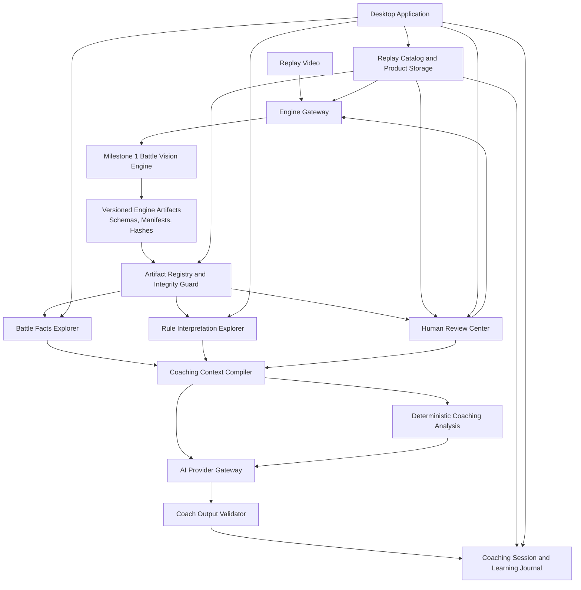
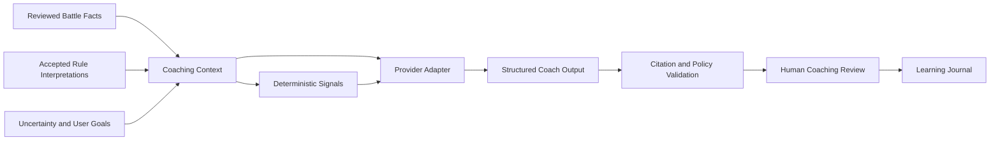

# Battle Vision Milestone 2 Product Architecture

## Document Status

This document is the **approved initial architecture baseline for Battle Vision Milestone 2**.
It defines the product direction, system boundaries, data authority model, workflows,
module responsibilities, technology evaluation, roadmap, and acceptance criteria that
future Milestone 2 work must follow.

Milestone 1 remains governed by the normative repository documents:

- [Domain Principles](../../architecture/domain_principles.md)
- [Evidence Model](../../architecture/evidence_model.md)

If a future product decision conflicts with those documents, the Milestone 1 domain and
evidence rules take precedence.

## Decision Status

### Accepted decisions

- The Milestone 1 Engine is stable backend infrastructure and is not redesigned by
  Milestone 2.
- The product consumes the Engine through its existing CLI, schemas, manifests, hashes,
  and replay artifacts.
- Battle Facts are immutable and authoritative.
- Rule Interpretations remain derived records, separate from observations and Battle
  Facts.
- The product is local-first, single-user, and intended primarily as a personal desktop
  application.
- Replay management is replay-centered and supports both legacy and namespaced artifact
  layouts without moving existing outputs.
- Human Review remains an explicit quality gate. Product UI may improve the workflow but
  may not bypass or auto-complete human decisions.
- Coaching is hybrid: deterministic analysis is preferred where structured evidence is
  sufficient; LLM reasoning occurs only after a structured context exists.
- AI providers are replaceable. AI may not inspect replay video directly, create or
  rewrite Battle Facts, or impersonate Rule Interpretation output.
- Every coaching claim must be traceable to structured evidence or clearly labeled as a
  hypothesis.
- Milestone 2 is a modular desktop product, not a SaaS platform, simulator, team builder,
  or generic video-analysis system.

### Provisional decisions

The following are recommended directions, but remain subject to focused implementation
validation before becoming permanent commitments:

- PySide6 with Qt Widgets as the desktop UI stack.
- A hybrid persistence model with Engine artifacts on the filesystem and SQLite for
  product-owned catalog, workflow, review-index, and coaching-session state.
- A separate product runtime dependency boundary from the frozen Engine runtime.
- Ollama as the first local AI adapter and one native cloud-provider adapter as the first
  provider-independence proof.
- PyPA entry points as a future plugin discovery mechanism; no general plugin framework is
  approved for the initial product.
- The final user workspace location and managed-copy policy for replay videos.
- The exact milestone labels after Milestone 2A. Their dependency order is accepted, but
  scope may be refined as each milestone is planned.

## 1. Product Vision

Battle Vision is a Pokémon battle review and coaching platform built on deterministic game
understanding. Its intended everyday workflow is:

1. Import a recorded official battle.
2. Run the stable Battle Vision Engine.
3. Resolve only the evidence that genuinely requires Human Review.
4. Inspect a trustworthy Battle Timeline and immutable Battle Facts.
5. Inspect knowledge-based Rule Interpretations without confusing them with observations.
6. Use deterministic analysis and an optional AI Coach to review key decisions,
   alternatives, and practice goals.
7. Preserve user-confirmed lessons in a personal learning journal.

The product reduces the cost of disciplined replay review. It does not promise an optimal
move oracle and does not use an LLM as a substitute for the Engine.

### 1.1 Canonical information flow

```text
Replay Video
    ↓
Battle Vision Engine
    ↓
Immutable Battle Facts
    ↓
Rule Interpretation
    ↓
Deterministic Coaching Context
    ↓
Optional AI Coach
    ↓
User
```

Information may move downward only. No downstream layer may rewrite an upstream layer.

### 1.2 Product priorities

Optimize for:

- usability after every battle;
- evidence visibility;
- maintainability;
- workflow continuity;
- local privacy;
- modularity;
- provider independence;
- future replay-to-replay learning.

Do not optimize for:

- commercialization or SaaS;
- enterprise deployment;
- multi-user collaboration;
- localization;
- arbitrary video formats;
- simulation completeness;
- autonomous real-time play.

## 2. Product Differentiation

Existing competitive Pokémon tools generally specialize in one of three areas:

| Product category | Typical source | Primary value |
| --- | --- | --- |
| Showdown replay tools | Structured simulator logs | Replay, aggregation, statistics |
| Team and matchup tools | Team sets, rules, calculators, simulators | Pre-battle preparation |
| LLM coaching tools | Manually supplied text, logs, or prompts | Explanation and suggestions |
| Battle Vision | Evidence reconstructed from official video | Auditable review and evidence-grounded coaching |

Battle Vision differentiates itself through:

- official recorded video as the evidence source;
- deterministic reconstruction before coaching;
- evidence-linked immutable Battle Facts;
- strict separation of observation, fact, interpretation, and analysis;
- Human Review as a first-class workflow;
- local-first operation;
- model-independent coaching;
- reproducible context and output provenance.

### 2.1 Ideas to adopt from existing work

- Pokémon Showdown: deterministic event ordering, replay navigation, and explicit public
  versus hidden information boundaries.
- PASRS, VS Recorder, and Reportworm: replay libraries, team grouping, and personal
  cross-replay summaries.
- Stratagem: task-focused workspaces instead of one undifferentiated dashboard.
- VGC Coach: shared provider-independent coaching rules, source-aware advice, fixed
  evaluation cases, and rubrics.
- Metamon and VGC-Bench: versioned analysis backends, reproducible evaluation, and explicit
  treatment of partial observability and generalization limits.
- PokeLLMon and related research: knowledge grounding and output consistency, without
  adopting agent authority over truth.

### 2.2 Ideas not to adopt

- Simulator-derived events as substitutes for video observations.
- Usage statistics or meta assumptions written into Battle Facts.
- Prompt-only coaching without structured evidence.
- Hidden-team completion presented as known truth.
- An all-in-one team builder, damage calculator, and battle simulator.
- AI-generated optimality claims without a validated solver.
- Cloud accounts, shared workspaces, or multi-user infrastructure during Milestone 2.

## 3. System Architecture



### 3.1 Boundary rules

- The desktop UI does not import checkpoint implementation internals.
- The product does not edit Engine artifacts directly.
- The Engine Gateway uses supported CLI inputs and validated artifact contracts.
- The product database is not a replacement source of truth for Engine outputs.
- AI providers do not scan the output tree or choose their own evidence.
- AI outputs never flow back into Observation, Battle Fact, or Rule Interpretation layers.
- A disputed Battle Fact creates a dispute or reprocessing request; it is not edited in
  place.
- A deliberate rerun creates a distinct analysis revision. Completed revisions are not
  silently overwritten by product workflow.

## 4. Data Authority Model

| Data | Authority | Mutation policy | Canonical storage |
| --- | --- | --- | --- |
| Replay video | Original evidence | Read-only after registration | Original file or managed copy |
| Engine manifests and artifacts | Canonical structured evidence | Immutable | Filesystem |
| Battle Facts | Authoritative reconstructed facts | Immutable | Engine artifacts |
| Rule Interpretations | Derived knowledge records | Never modify Facts | Engine artifacts |
| Human Review decisions | Human judgment and gate evidence | Append-only revisions | Review artifacts and product index |
| Product projections | Query and display cache | Rebuildable | Product storage |
| Coaching contexts and outputs | Derived, versioned analysis | New revisions only | Versioned artifacts and product index |
| User notes and accepted lessons | User-owned knowledge | User-editable | Product storage and export |

If the product indexes a Battle Fact in SQLite or another store, that row is a disposable
projection. It must be possible to rebuild it from the Engine artifacts.

## 5. Repository Reality and Initial Adaptation

The approved product architecture is replay-centered, but the current repository contains
two valid artifact layouts:

```text
outputs/
├── checkpoint-1a/ ... checkpoint-1j/       # legacy win-01 layout
└── replays/
    └── official-02/
        ├── inputs/
        └── checkpoint-1a/                  # namespaced replay layout
```

The initial product foundation must therefore:

- identify `win-01` from the legacy layout;
- discover replay IDs dynamically beneath `outputs/replays/`;
- preserve distinct replay identities;
- read the strongest available checkpoint report or manifest;
- report `needs_review`, `incomplete`, or `invalid` from artifact evidence rather than
  crashing or assuming a frozen record count;
- avoid moving, renaming, copying, or regenerating any existing output;
- avoid treating Checkpoint 1A anchor images as downstream coaching evidence.

Manifest naming is not uniform across all checkpoints: 1A and 1B expose checkpoint reports,
while later checkpoints expose checkpoint manifests. The Product Artifact Gateway adapts
that existing reality; Milestone 1 files are not renamed to create a cleaner product API.

The first Milestone 2A slice therefore uses a read-only filesystem-backed catalog. SQLite,
desktop UI, background jobs, and writable orchestration are deliberately deferred.

## 6. Product Modules

### 6.1 Replay Catalog and Workspace

**Purpose:** Manage replay identity, video location, artifact workspace, analysis revisions,
workflow status, and user metadata.

**Rationale:** The Engine is checkpoint-centered; the product must be replay-centered.

**User value:** A user can find replays that are processing, waiting for review, ready for
analysis, or archived.

**Dependencies:** Product storage, filesystem, Artifact Registry.

**Future extensibility:** Team, regulation, tournament, best-of-three set, and personal tags.

### 6.2 Replay Intake and Engine Orchestrator

**Purpose:** Register a video, validate the supported profile, create a replay workspace,
run supported checkpoints, and stop at Human Review gates.

**Rationale:** Normal product use must not require manually composing checkpoint commands.

**User value:** One guided replay workflow with understandable states and recoverable
errors.

**Dependencies:** Existing CLI, replay parameterization, manifests, hashes.

**Future extensibility:** Additional explicitly supported profiles; not arbitrary video
normalization.

### 6.3 Artifact Registry and Integrity Guard

**Purpose:** Discover and validate checkpoint artifacts through manifests, schemas, hashes,
counts, ordering, and provenance.

**Rationale:** The UI must not infer correctness from the presence of a directory.

**User value:** Clear distinction among complete, incomplete, pending-review, damaged, and
out-of-date replays.

**Dependencies:** Engine schemas and artifact filesystem.

**Future extensibility:** Archive export, migration reports, and read-only diagnostics.

### 6.4 Human Review Center

**Purpose:** Project existing review gates into a unified review queue.

**Rationale:** Checkpoint-specific JSON and review packs are correct backend contracts but
are fragmented for routine product use.

**User value:** Review only the evidence that needs a person, with progress preserved across
sessions.

**Dependencies:** Existing review schemas and manifests, Video Evidence Viewer.

**Future extensibility:** Keyboard-first workflows, safe batch decisions, and reusable note
templates. Automatic human conclusions remain forbidden.

### 6.5 Video Evidence Viewer

**Purpose:** Synchronize replay video, PTS, ROI crops, representative frames, source records,
and confidence data.

**Rationale:** Human Review and Fact verification must return to concrete visual evidence.

**User value:** No manual switching among Finder, JSON, contact sheets, and a media player.

**Dependencies:** Replay Catalog, Artifact Registry, PTS mapping.

**Future extensibility:** Multi-evidence comparison, frame stepping, and boundary preview;
not video editing.

### 6.6 Battle Facts Explorer

**Purpose:** Present the Battle Timeline, state, entities, HP, moves, status, field state,
and Fact ledger.

**Rationale:** Battle Facts are the product core and must remain inspectable independently
of AI summaries.

**User value:** Understand a battle and verify each claim before reading coaching advice.

**Dependencies:** Checkpoint 1H outputs, Artifact Registry, Video Evidence Viewer.

**Future extensibility:** Cross-replay exact-fact queries and decision-cycle navigation.

Each Fact must support the following provenance path:

```text
Battle Fact
    → supporting observations
    → source event or timeline group
    → PTS, frame, and ROI evidence
```

### 6.7 Rule Interpretation Explorer

**Purpose:** Present how versioned knowledge interprets Facts, including confidence, source
knowledge, and Human Review decisions.

**Rationale:** Users must not confuse a rule inference with a video observation.

**User value:** Clear separation of observed, interpreted, unresolved, and rejected claims.

**Dependencies:** Checkpoint 1I and 1J outputs, Battle Facts Explorer.

**Future extensibility:** New additive knowledge packs and interpretation revision
comparison.

### 6.8 Coaching Context Compiler

**Purpose:** Build a finite, reproducible context snapshot from reviewed Facts, accepted
Interpretations, explicit uncertainty, and user-authored goals.

**Rationale:** AI providers must not browse the artifact tree or select their own truth.

**User value:** Every coaching result can disclose exactly what evidence the model saw.

**Dependencies:** Battle Facts, Interpretations, review completion state.

**Future extensibility:** Multiple coaching modes sharing one context contract.

A context snapshot records at least:

- replay ID and analysis revision;
- source manifest hashes;
- included Battle Fact IDs;
- included Rule Interpretation IDs;
- unresolved or ambiguous evidence;
- user-authored goals;
- context schema version.

### 6.9 Deterministic Coaching Analyzer

**Purpose:** Identify reliable review structure and candidate learning moments using
structured evidence before invoking an LLM.

**Rationale:** Deterministic conclusions should not be delegated to probabilistic text
generation.

**User value:** A useful review outline remains available with all AI providers disabled.

**Dependencies:** Coaching Context.

**Future extensibility:** Versioned, evaluated coaching rules that remain downstream of
Facts.

Appropriate early responsibilities include:

- Team Preview versus observed bring selection;
- decision-cycle boundaries;
- explicit HP, status, weather, terrain, and field-state changes;
- uncertainty warnings;
- structural turning-point candidates;
- repeated user review tags.

The module does not claim a unique optimal move without a separately validated solver.

### 6.10 AI Provider Gateway

**Purpose:** Provide one product contract for local and cloud language-model providers.

**Rationale:** Provider SDKs and model branding must not define coaching semantics.

**User value:** The user can choose privacy, cost, latency, and quality without changing
the Engine or coaching model.

**Dependencies:** Coaching Context, provider adapters, credential storage.

**Future extensibility:** New providers are adapters, not domain changes.

Provider, model, and capability are separate concepts:

- provider: OpenAI, Gemini, Ollama, llama.cpp endpoint, or another service;
- model: GPT, Gemini, Qwen, Llama, or another model family;
- capability: structured output, streaming, context window, tools, and local/cloud mode.

### 6.11 Coach Output Validator

**Purpose:** Validate output schema, citations, claim kinds, uncertainty, and evidence
discipline.

**Rationale:** Schema-conforming output can still contain unsupported claims.

**User value:** Unsupported coaching is visible and does not silently become trusted data.

**Dependencies:** AI Provider Gateway, Fact and Interpretation registries.

**Future extensibility:** Provider comparisons and coaching regression evaluation.

Minimum validation includes:

- every referenced ID exists;
- a Fact claim does not exceed its cited Fact;
- hypotheses are explicitly labeled;
- rejected Interpretations are not presented as truth;
- `unknown`, `ambiguous`, and `unresolved` are not silently completed;
- provider response, model version, prompt package, context hash, and validation result are
  recorded.

### 6.12 Coaching Session and Learning Journal

**Purpose:** Preserve questions, validated coach findings, user feedback, accepted lessons,
and the next practice goal.

**Rationale:** A single generated answer does not create a durable improvement loop.

**User value:** Each replay produces an intentional lesson that can be revisited in later
battles.

**Dependencies:** Validated coaching output and Replay Catalog.

**Future extensibility:** Cross-replay patterns, team-specific lessons, and practice plans.

AI suggestions and user-accepted lessons remain separate records. Only the user can promote
a suggestion into the personal journal.

### 6.13 Extension Registry

**Purpose:** Define narrow, safe extension seams without creating an unrestricted plugin
system.

**Rationale:** Premature plugin infrastructure would increase complexity and could weaken
the evidence boundary.

**User value:** Future providers and exports can evolve without destabilizing the product.

**Dependencies:** Explicit provider, import, and export contracts.

**Future extensibility:** Built-in registry first, PyPA entry points when an actual external
plugin exists, and structured hooks only if multiple implementations require them.

Allowed extension areas:

- AI providers;
- coaching presentation styles;
- report exporters;
- replay metadata importers;
- knowledge package readers.

Forbidden extension areas:

- direct Observation mutation;
- direct Battle Fact mutation;
- Human Review bypass;
- replacement of Engine truth.

## 7. Replay Workflow

The product exposes domain-oriented states rather than requiring users to understand every
checkpoint number:

```text
Imported
    → Compatibility Check
    → Setup Review Required
    → Engine Processing
    → Evidence Review Required
    → Facts Ready
    → Interpretation Review Required
    → Coach Ready
    → Review Completed
    → Archived
```

Workflow rules:

1. Register the replay without moving it by default.
2. Establish replay identity and detect duplicates.
3. Run supported compatibility and onboarding checks.
4. Stop at every existing Human Review gate.
5. Validate manifests, schemas, hashes, ordering, and provenance after each checkpoint.
6. Resume only after schema-valid review completion.
7. Expose Battle Facts before offering AI coaching.
8. Build a fixed coaching context only after eligibility checks.
9. Save user-confirmed lessons separately from generated suggestions.

Checkpoint 1A anchor screenshots remain onboarding and ROI-geometry evidence only. They are
not OCR, Battle Fact, Rule Interpretation, or coaching inputs.

## 8. Human Review Workflow

Every projected review item includes:

- task type and source ID;
- predicted value and confidence;
- PTS or time range;
- representative evidence and full-frame context;
- allowed decisions from the existing schema;
- review note;
- upstream source hash;
- downstream gate impact.

```text
Review Inbox
    → Select Item
    → Inspect Evidence
    → Record Human Decision
    → Validate Local Consistency
    → Complete Review Group
    → Validate Schema and Completeness
    → Resume Engine
```

The product never deletes original candidates, relations, Facts, or Interpretations. Human
decisions remain separate review evidence with reviewer identity, timestamp, and source
provenance.

## 9. Battle Facts Workflow

The primary battle-review workspace synchronizes:

1. Replay Timeline;
2. Battle State;
3. Fact Ledger;
4. Evidence Inspector.

Selecting a timeline record reveals the known active Pokémon, state changes, related Facts,
supporting observations, Rule Interpretations, and original visual evidence.

If a user disputes a Fact, the product records the dispute and may initiate a new analysis
revision. It does not edit the existing Fact.

## 10. Rule Interpretation Workflow

Rule Interpretations are displayed separately from Facts. Each record exposes:

- Interpretation ID;
- referenced Battle Fact IDs;
- knowledge ID and version;
- confidence and uncertainty;
- accepted, rejected, or needs-review state;
- source rule provenance.

The product may display and review Engine-generated Interpretations. An AI Coach may propose
a hypothesis, but it may not create a record that impersonates a formal Rule Interpretation.

## 11. AI Coach Workflow



Recommended coaching claim kinds:

- `fact_summary`: a bounded restatement of cited Facts;
- `key_decision`: a decision point worth reviewing;
- `rule_context`: an explanation grounded in accepted Rule Interpretations;
- `alternative_line`: an explicitly hypothetical alternative;
- `uncertainty`: missing or ambiguous evidence;
- `practice_lesson`: a reusable thinking pattern;
- `question_for_player`: a request for the player's unavailable intent or context.

The AI Coach must not:

- infer player intent as fact;
- use hindsight to assert a uniquely correct decision;
- present unseen moves, items, abilities, targets, or team members as observed;
- claim to have run a simulator or damage calculation when it has not;
- inspect replay video directly;
- write or correct a Battle Fact;
- bypass rejected or unresolved review evidence.

## 12. Technology Evaluation

### 12.1 Desktop and GUI framework

| Candidate | Strengths | Costs | Direction |
| --- | --- | --- | --- |
| PySide6 and Qt | Python ecosystem alignment, mature desktop controls, strong model/view and media support | Packaging and styling require discipline | Recommended, provisional |
| SwiftUI | Native macOS experience and platform services | Separate Swift/Python stacks and a stronger platform lock | Reassess only if macOS-native UX outweighs maintenance cost |
| Tauri | Lightweight web UI with process isolation | Rust, web frontend, and Python create three maintenance surfaces | Not recommended initially |
| Electron | Mature web ecosystem | Bundled Chromium, memory footprint, and larger security surface | Not recommended |

Qt Widgets are recommended over QML for the first desktop slice because the product is
dominated by dense tables, trees, review forms, timelines, and keyboard-driven workflows.
This choice remains provisional until a focused UI spike validates packaging and video
evidence playback without changing the Engine runtime.

### 12.2 API and process boundary

| Approach | Decision |
| --- | --- |
| UI imports Engine checkpoint internals | Rejected due to coupling |
| Product application services plus Engine CLI/artifact contract | Recommended |
| Local FastAPI server | Deferred; no client requires it yet |
| JSON-RPC local IPC | Possible future bridge for a non-Python shell |
| gRPC | Excessive for a single-user desktop product |

Milestone 2 starts as a modular monolith. Long-running Engine work may execute in a worker
process, but there is no microservice, message broker, or distributed job system.

### 12.3 Product storage

Recommended long-term storage is hybrid:

- Engine artifacts remain canonical filesystem files;
- SQLite stores product-owned replay catalog, workflow, review index, notes, and sessions;
- coaching context and output remain versioned JSON artifacts with a product index;
- replay video is registered by path and content identity by default;
- API credentials use the operating-system credential store;
- no vector database is introduced without a demonstrated retrieval need.

DuckDB may become a rebuildable analytical projection only if cross-replay volume justifies
it. It is not an application source of truth.

### 12.4 Local and cloud AI

The provider gateway treats provider, model, and capability independently. Local options
include Ollama and llama.cpp; cloud providers receive native adapters rather than relying
on nominal API compatibility.

The product owns a conservative structured-output schema and validates all provider output
locally. Provider support for JSON output is not itself sufficient evidence of semantic
correctness.

### 12.5 Plugin policy

Milestone 2 defines extension ports but does not initially implement a general plugin
framework. A built-in adapter registry is sufficient until an external provider or exporter
creates a concrete need. Plugins never receive mutation authority over Engine truth.

## 13. Recommended Project Structure

```text
pokemon-battle-vision-lab/
├── architecture/
│   ├── domain_principles.md
│   └── evidence_model.md
├── docs/
│   └── milestone2/
│       ├── README.md
│       └── product_architecture.md
├── src/
│   ├── pokemon_battle_vision/        # Stable Milestone 1 Engine
│   └── battle_vision_product/
│       ├── domain/
│       │   └── replay/
│       ├── application/
│       ├── ports/
│       └── adapters/
│           ├── artifacts/
│           └── engine/
├── schemas/
│   └── product/                      # Added only when a durable product artifact exists
└── tests/
    └── product/
```

Future user runtime data should live outside the source repository, but the exact location
is provisional. Existing `outputs/` trees are registered in place rather than migrated.

## 14. Milestone Roadmap

### Milestone 2A — Product Foundation

**Objective:** Establish replay-centered product boundaries without changing the Engine.

**Expected deliverables:**

- approved architecture documentation;
- separate product package namespace;
- read-only replay discovery;
- minimal Replay Catalog and Engine Gateway contracts;
- artifact-evidence status projection;
- tests proving existing artifacts remain untouched;
- later slices: writable orchestration, persistent catalog, and desktop shell foundation.

**Dependencies:** Stable Milestone 1 artifacts and replay parameterization.

**Implementation order:** Read-only discovery first, then persistent product state, then
orchestration, then desktop shell.

### Milestone 2B — Unified Human Review Center

**Objective:** Present existing review gates as one durable workflow.

**Expected deliverables:** Review Inbox, Video Evidence Viewer, checkpoint review adapters,
progress persistence, completion validation, and supported Engine resume.

**Dependencies:** Milestone 2A.

### Milestone 2C — Evidence-led Battle Review

**Objective:** Enable a complete replay review without AI.

**Expected deliverables:** Battle Timeline, state view, Fact Ledger, evidence drill-down,
uncertainty filters, and dispute workflow.

**Dependencies:** Milestones 2A and 2B, Checkpoint 1H artifacts.

### Milestone 2D — Rule Interpretation Workspace

**Objective:** Present reviewed knowledge interpretation safely above Battle Facts.

**Expected deliverables:** Interpretation Explorer, knowledge version display, Fact links,
Human Review, and accepted/rejected/unresolved filters.

**Dependencies:** Milestone 2C, Checkpoint 1I and 1J artifacts.

### Milestone 2E — Coaching Contract and Deterministic Review

**Objective:** Define coaching data and useful non-LLM review behavior.

**Expected deliverables:** Coaching Context schema, deterministic signals, key-decision
candidates, citation policy, evaluation fixtures, and coaching quality rubric.

**Dependencies:** Milestones 2C and 2D.

### Milestone 2F — Model-independent AI Coach

**Objective:** Add optional replaceable AI coaching after deterministic context exists.

**Expected deliverables:** Provider Gateway, one local adapter, one cloud adapter, structured
validation, citation validation, provider comparison, and offline behavior.

**Dependencies:** Milestone 2E.

### Milestone 2G — Personal Learning Loop

**Objective:** Convert individual reviews into durable practice.

**Expected deliverables:** Coaching Sessions, user-accepted lessons, notes, next-battle focus,
tags, basic cross-replay patterns, and practice journal.

**Dependencies:** Milestone 2F.

### Milestone 2H — Desktop Hardening

**Objective:** Make the application reliable for routine personal use.

**Expected deliverables:** macOS packaging, crash recovery, product-data migrations,
workspace backup and restore, export, diagnostics, performance work, privacy controls,
credential management, and onboarding documentation.

**Dependencies:** Milestones 2A through 2G.

## 15. Product Acceptance Criteria

Milestone 2 is accepted when a user can:

1. Register a new video that matches a supported profile.
2. Run the Engine without manually composing checkpoint commands.
3. Complete all Human Review gates in one product workflow.
4. Inspect a complete Battle Timeline and immutable Battle Facts.
5. Navigate from every displayed Fact to its supporting evidence.
6. Distinguish Observation, Battle Fact, Rule Interpretation, hypothesis, and coaching
   advice.
7. Use either local or cloud AI, or disable AI entirely.
8. Change AI providers without modifying Engine or coaching semantics.
9. Promote selected coaching suggestions into user-owned practice lessons.
10. Inspect recurring verified patterns across later replays.
11. Complete the workflow without allowing AI to modify or replace Engine truth.

## 16. Recommended Implementation Order

```text
Replay Workspace
    → Human Review
    → Evidence Explorer
    → Rule Interpretation
    → Deterministic Coaching Contract
    → AI Coach
    → Personal Learning Loop
```

An AI chat interface before the evidence and coaching contracts would turn the product into
a general model reading loosely selected JSON. The approved order ensures that AI remains a
consumer of Battle Vision rather than a replacement for it.
